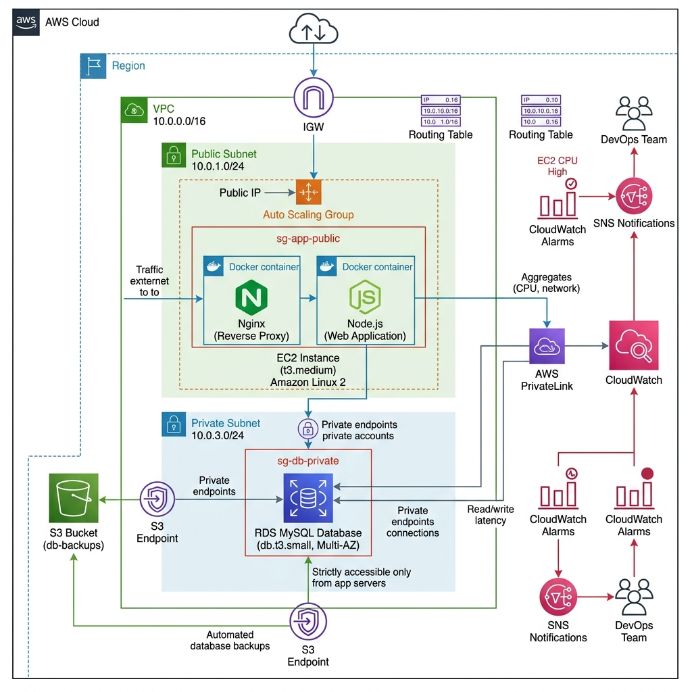
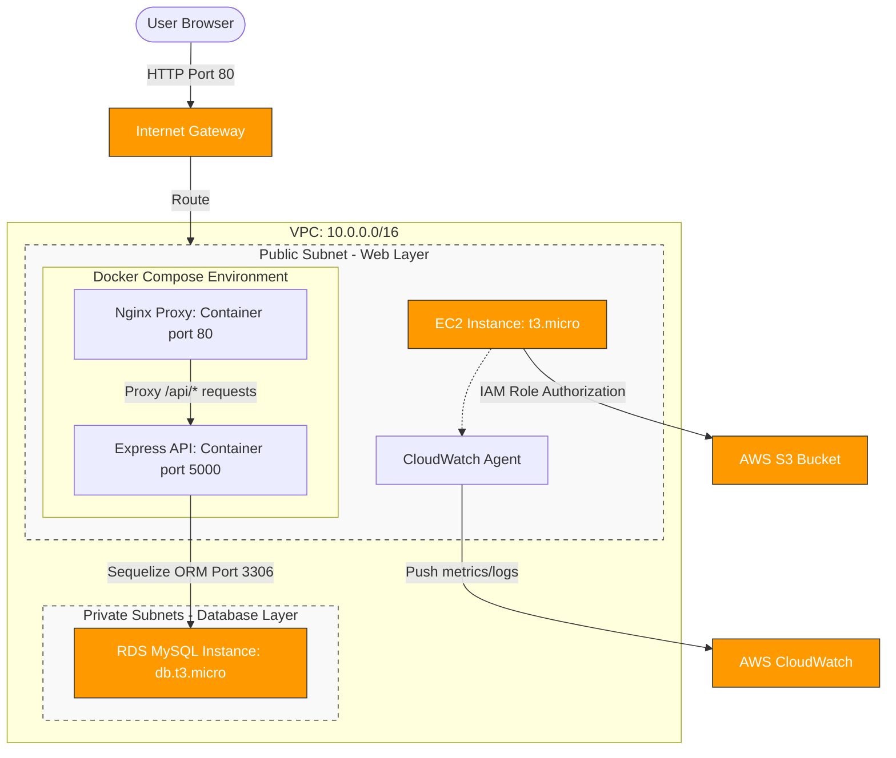

# MetaSpace Digital Twin Operations Cloud
## Project Documentation and Implementation Guide (Case Study 145)

MetaSpace Digital Twin Operations Cloud is a centralized cloud engineering platform built to support the rapid growth of metaverse infrastructure and digital twin assets. Traditional operations rely on disconnected systems, spreadsheets, and manual workflows. This project provides a centralized, scalable, and highly available web application to monitor, manage, and report on digital twins, device logs, and system metrics.

---

## Table of Contents
1. [System Architecture](#1-system-architecture)
2. [Technology Stack and Versions](#2-technology-stack-and-versions)
3. [Local Development and Setup](#3-local-development-and-setup)
4. [Production AWS Infrastructure](#4-production-aws-infrastructure)
5. [AWS Deployment Steps](#5-aws-deployment-steps)
6. [Linux Administration and Hardening](#6-linux-administration-and-hardening)
7. [Backup and Automation Scripts](#7-backup-and-automation-scripts)
8. [Monitoring and Resource Alarms](#8-monitoring-and-resource-alarms)
9. [Troubleshooting and Problems Solved](#9-troubleshooting-and-problems-solved)
10. [AWS Cost Estimation and Analysis](#10-aws-cost-estimation-and-analysis)
11. [Project Learnings and Takeaways](#11-project-learnings-and-takeaways)
12. [GitHub Actions CI/CD Pipeline](#12-github-actions-cicd-pipeline)
13. [Deployment Screenshots](#13-deployment-screenshots)

---

## 1. System Architecture



The project is designed with a secure multi-subnet network architecture that isolates database resources while keeping web servers publicly accessible.

### Network Design
- **Virtual Private Cloud (VPC)**: 10.0.0.0/16 address space.
- **Public Subnet A**: 10.0.1.0/24 (us-east-1a) housing the EC2 web server instance.
- **Public Subnet B**: 10.0.2.0/24 (us-east-1b) reserved for high availability expansion.
- **Private Subnet A**: 10.0.3.0/24 (us-east-1a) housing the RDS MySQL primary database.
- **Private Subnet B**: 10.0.4.0/24 (us-east-1b) containing the RDS subnet group backup, which is required by AWS RDS.
- **Internet Gateway (IGW)**: Directs internet traffic to the public subnets.
- **Security Groups**:
  - **EC2 Security Group**: Allows inbound traffic on port 22 (SSH for administration), port 80 (HTTP traffic), and port 443 (HTTPS traffic).
  - **RDS Security Group**: Allows inbound traffic on port 3306 (MySQL) strictly from the EC2 security group, blocking direct public internet access to the database.

### Request Flow
1. The user browser requests the static frontend pages over port 80 from Nginx on the EC2 instance.
2. The Nginx reverse proxy routes all backend API calls (requests matching `/api/*`) to the Node.js Express server running on port 5000.
3. The Express backend connects to the RDS MySQL database in the private subnet using the Sequelize Object Relational Mapping (ORM) framework to fetch or store data.

### Text-Based Architecture Diagram
```
┌─────────────────────────────────────────────────────────────────────┐
│                    AWS Cloud (us-east-1)                            │
│                                                                     │
│  ┌─────────────────────────── VPC: 10.0.0.0/16 ─────────────────┐  │
│  │                                                               │  │
│  │  ┌───────────────────────────────────────────────────────┐   │  │
│  │  │           PUBLIC SUBNET (10.0.1.0/24)                 │   │  │
│  │  │                                                       │   │  │
│  │  │   ┌─────────────────────────────────────────────┐    │   │  │
│  │  │   │         EC2 Instance (t3.micro)             │    │   │  │
│  │  │   │                                             │    │   │  │
│  │  │   │  [Docker Compose]                           │    │   │  │
│  │  │   │  ├─ Nginx container  :80/:443               │    │   │  │
│  │  │   │  │   ├─ Serves React SPA static files       │    │   │  │
│  │  │   │  │   └─ Proxies /api to backend:5000        │    │   │  │
│  │  │   │  └─ Node.js container :5000                 │    │   │  │
│  │  │   │      └─ Express API and Sequelize ORM       │    │   │  │
│  │  │   │                                             │    │   │  │
│  │  │   │  [CloudWatch Agent] (Sends metrics/logs)     │    │   │  │
│  │  │   │  [IAM Instance Role] (Grants S3/CW access)  │    │   │  │
│  │  │   └─────────────────────────────────────────────┘    │   │  │
│  │  └───────────────────────────────────────────────────────┘   │  │
│  │                              │                                │  │
│  │                 [Security Group: Port 3306]                   │  │
│  │                              ▼                                │  │
│  │  ┌───────────────────────────────────────────────────────┐   │  │
│  │  │     PRIVATE SUBNETS (10.0.3.0/24 + 10.0.4.0/24)       │   │  │
│  │  │                                                       │   │  │
│  │  │   ┌─────────────────────────────────────────────┐    │   │  │
│  │  │   │     RDS MySQL 8.0 Database (db.t3.micro)    │    │   │  │
│  │  │   │     - Isolated from direct public web access  │    │   │  │
│  │  │   │     - Automatic storage scaling and backup    │    │   │  │
│  │  │   └─────────────────────────────────────────────┘    │   │  │
│  │  └───────────────────────────────────────────────────────┘   │  │
│  │                                                               │  │
│  └───────────────────────────────────────────────────────────────┘  │
│                                                                     │
│  ┌─────────────┐   ┌────────────────┐   ┌────────────────────────┐  │
│  │  S3 Bucket  │   │   CloudWatch   │   │   IAM Role             │  │
│  │  - Backups  │   │  - Alarms      │   │  - EC2 instance rights │  │
│  │  - Assets   │   │  - Dashboards  │   │  - CloudWatch writing  │  │
│  │  - Log files│   │  - Metric logs │   │  - S3 backups writing  │  │
│  └─────────────┘   └────────────────┘   └────────────────────────┘  │
│                                                                     │
└─────────────────────────────────────────────────────────────────────┘
         ▲
         │ (Internet Gateway)
         │
     [Internet]
         │
    [User Browser]
```

### Mermaid Architecture Diagram


---

## 2. Technology Stack and Versions

### Frontend
- **Framework**: React version 19.0.0 (provides fast declarative rendering).
- **Build Tool**: Vite version 6.0.0 (handles quick development builds).
- **Routing**: React Router DOM version 7.0.0 (handles dashboard navigation).
- **Data Visualization**: Chart.js version 4.4.1 and React-Chartjs-2 version 5.2.0 (renders digital twin KPIs).
- **HTTP Client**: Axios version 1.7.9 (communicates with the Express API).
- **Icons**: Lucide React version 0.468.0 (visual components).
- **Styling**: Vanilla CSS (provides layout control).

### Backend
- **Runtime**: Node.js version 22.12.0 LTS (provides async Javascript execution).
- **Web Server**: Express version 4.21.2 (handles API routes).
- **ORM**: Sequelize version 6.37.5 (connects schemas to SQL code).
- **SQL Driver**: MySQL2 version 3.11.5 (executes database queries).
- **Authorization**: Jsonwebtoken version 9.0.2 (manages token authorization).
- **Encryption**: Bcryptjs version 2.4.3 (hashes user passwords).
- **Configuration**: Dotenv version 16.4.7 (loads system environment variables).
- **Middlewares**:
  - Cors version 2.8.5 (cross origin configuration).
  - Helmet version 8.0.0 (injects security headers).
  - Express-rate-limit version 7.5.0 (blocks brute force attacks).
  - Morgan version 1.10.0 (logs API request details).

### Database
- **Engine**: MySQL version 8.0 (handles operational table structures).
- **Local Database**: Local MySQL via Docker Compose.
- **Production Database**: AWS RDS MySQL Multi-AZ subnet group deployment.

### DevOps and Infrastructure
- **IaC**: Terraform version 1.9.8 (deploys resources using variables).
- **Containerization**: Docker version 27.x and Docker Compose version 2.x (packages and links code).
- **Web Proxy**: Nginx version 1.26 (Alpine base) serving build directories and re-routing endpoints.

---

## 3. Local Development and Setup

To run and verify the codebase locally, use these steps.

### Prerequisites
- Install Docker Desktop and make sure the Docker Daemon is active.
- Install Node.js version 22.x on your local machine.

### Local Setup Steps
1. Navigate to the project root directory:
   ```bash
   cd /Users/saurabhyadav/Desktop/MetaSpace
   ```

2. Create a local environment file in the backend directory named `/Users/saurabhyadav/Desktop/MetaSpace/backend/.env`:
   ```env
   NODE_ENV=development
   PORT=5001
   DB_HOST=127.0.0.1
   DB_USER=root
   DB_PASS=localpass123
   DB_NAME=metaspace_db
   JWT_SECRET=supersecretlocaltokenkey12345
   ```

3. Create a local environment file in the frontend directory named `/Users/saurabhyadav/Desktop/MetaSpace/frontend/.env`:
   ```env
   VITE_API_URL=http://localhost:5001/api/v1
   ```

4. Boot the database and application containers using the local Docker Compose configuration:
   ```bash
   docker compose -f docker-compose.yml up -d --build
   ```

5. Once containers are running, run the Sequelize migrations and data seeding on the local database container:
   ```bash
   docker compose exec backend npm run db:migrate
   ```

6. Open your browser and navigate to the application address:
   - Dashboard Interface: `http://localhost:8080`
   - API Backend Health Endpoint: `http://localhost:5001/health`
   - Credentials for Login: `admin@metaspace.io` / `Admin@123`

7. To stop and clean up the local containers, run:
   ```bash
   docker compose down -v
   ```

---

## 4. Production AWS Infrastructure

Our production infrastructure is written in Terraform modules located inside the `/Users/saurabhyadav/Desktop/MetaSpace/terraform` directory.

- **VPC Module**: Creates the base VPC, internet gateways, route tables, two public subnets, and two private subnets across multiple availability zones.
- **EC2 Module**: Spins up an Ubuntu 22.04 LTS instance, allocates a public elastic IP, creates security group rules allowing ports 22, 80, and 443, and assigns an IAM profile.
- **RDS Module**: Configures a Single-AZ RDS MySQL database in the private subnets. Only accepts traffic from the EC2 instance on port 3306.
- **S3 Module**: Allocates a versioned, encrypted S3 bucket with lifecycle policies that transition log records to cheaper storage classes.

---

## 5. AWS Deployment Steps

Production provisioning and software deployment are fully automated.

### Provision and Deploy to AWS
Execute the unified deployment script. This script automatically runs the prerequisite checks, generates SSH keys, provisions infrastructure using Terraform, transfers files, configures Ubuntu, launches Docker containers, imports schemas to RDS, and starts CloudWatch monitoring:
```bash
export PATH="/Users/saurabhyadav/Desktop/MetaSpace/bin:$PATH"
bash scripts/prod-provision.sh
```

### Script Execution Flow
The provisioning script executes these specific steps under the hood:
1. Generates a new RSA SSH key pair locally at `~/.ssh/metaspace-key`.
2. Registers the public key with the AWS EC2 service:
   ```bash
   aws ec2 import-key-pair --key-name metaspace-key --public-key-material fileb://~/.ssh/metaspace-key.pub --region us-east-1
   ```
3. Generates secure random keys for the production database and JWT tokens:
   ```bash
   DB_PASS=$(openssl rand -base64 16 | tr -dc 'a-zA-Z0-9' | head -c 16)
   JWT_SECRET=$(openssl rand -base64 32 | tr -dc 'a-zA-Z0-9' | head -c 32)
   ```
4. Invokes Terraform to build the network, virtual server, database, and storage bucket:
   ```bash
   cd terraform
   terraform init
   terraform apply -var="db_password=$DB_PASS" -var="key_pair_name=metaspace-key" -auto-approve
   ```
5. Retrieves the dynamic AWS output values (EC2 public IP, S3 bucket name, RDS endpoint).
6. Packages the codebase into a compressed tarball:
   ```bash
   tar -czf metaspace.tar.gz --exclude='node_modules' --exclude='.git' --exclude='.terraform' --exclude='terraform.tfstate*' --exclude='*.tar.gz' --exclude='frontend/dist' .
   ```
7. Uploads the code tarball, environmental configuration files, and the setup script to the EC2 host:
   ```bash
   scp -i ~/.ssh/metaspace-key metaspace.tar.gz scripts/server-setup.sh .env ubuntu@$EC2_IP:/tmp/
   ```
8. Runs `/tmp/server-setup.sh` on the EC2 instance using root privilege.
9. Connects to the isolated RDS database from the EC2 instance and runs the initialization schema:
   ```bash
   mysql -h $RDS_ENDPOINT -u metaspace_admin -p$DB_PASS metaspace_db < /opt/metaspace/database/init.sql
   ```
10. Launches the production container stack using Docker Compose:
    ```bash
    docker-compose -f docker-compose.prod.yml up -d --build
    ```
11. Starts the CloudWatch agent and registers the daily database backups and resource health check scripts in the crontab.

### Verify Application Health
You can check if the API is active by requesting the health check path from your browser:
```bash
curl -s http://[EC2_PUBLIC_IP]/health
```
Expected output:
```json
{"status":"ok","timestamp":"...","service":"metaspace-api"}
```

### Tear Down AWS Infrastructure
To destroy all provisioned resources and prevent any AWS charges, execute the cleanup script:
```bash
export PATH="/Users/saurabhyadav/Desktop/MetaSpace/bin:$PATH"
bash scripts/prod-cleanup.sh
```
The script deletes S3 versions, tears down the Terraform resources, deletes the EC2 key pair registrations, and removes the local SSH key files from your machine.

---

## 6. Linux Administration and Hardening

The virtual machine runs on Ubuntu 22.04 LTS. The host configuration script `/Users/saurabhyadav/Desktop/MetaSpace/scripts/server-setup.sh` applies several operations:

### User Management
Three system users are configured on the virtual machine:
1. **metaspace-app**: A system user created with no shell privileges (`/sbin/nologin`) to execute background application processes safely.
2. **devops-user**: Created for operations personnel, with administrative privileges added to the `sudo` and `docker` system groups.
3. **monitor-user**: Created as a read-only login to inspect host logs without modification rights.

### File Permissions
We restrict folder access to prevent unauthorized writing or execution:
- The main directory `/opt/metaspace` is owned by `ubuntu:ubuntu` with `755` permissions.
- Log storage folders at `/var/log/metaspace` are secured with `755` permissions.

### SSH Hardening
To prevent brute force entries, password logins and root administrative connections are disabled. Authentication must use the imported SSH key file:
```ini
PermitRootLogin no
PasswordAuthentication no
```
The SSH daemon is restarted to load these rules:
```bash
systemctl restart sshd
```

### Firewall Configuration (UFW)
A host-level Uncomplicated Firewall (UFW) is configured to block all ports except SSH, standard HTTP, and HTTPS:
```bash
ufw allow 22/tcp
ufw allow 80/tcp
ufw allow 443/tcp
ufw --force enable
```

---

## 7. Backup and Automation Scripts

Routine tasks are handled by shell scripts registered as system cron jobs.

### Daily Database Backups
The script `/Users/saurabhyadav/Desktop/MetaSpace/scripts/backup.sh` is registered to run every day at 2:00 AM.
- It executes a SQL database dump using `mysqldump` with options `--single-transaction`, `--routines`, and `--triggers`.
- Compresses the file using `gzip` and uploads it to the S3 bucket using the AWS CLI.
- Automatically scans the S3 storage space for backups older than 30 days and rotates them out to save on storage fees.

### Resource Health Checks
The script `/Users/saurabhyadav/Desktop/MetaSpace/scripts/health-check.sh` executes every 5 minutes.
- It queries `http://localhost:5000/health` to confirm the backend API responds with an HTTP 200 status code. If the check fails, it restarts the backend Docker container.
- Checks the state of the Docker containers using `docker inspect`.
- Evaluates CPU usage, available memory, and disk space. If memory free drops below 15% or CPU load exceeds 85%, it writes warning flags to `/var/log/metaspace/health.log`.

### Crontab Registrations
These operations are added to the root crontab on the EC2 host:
```crontab
0 2 * * * cd /opt/metaspace && export DB_HOST=$RDS_ENDPOINT && export DB_USER=metaspace_admin && export DB_PASS=$DB_PASS && export AWS_BUCKET_NAME=$S3_BUCKET_NAME && bash scripts/backup.sh >> /var/log/metaspace/backup.log 2>&1
*/5 * * * * cd /opt/metaspace && bash scripts/health-check.sh >> /var/log/metaspace/health.log 2>&1
```

---

## 8. Monitoring and Resource Alarms

Enterprise monitoring is handled by AWS CloudWatch and SNS.

### CloudWatch Agent
The EC2 virtual machine runs the CloudWatch Agent using the parameters in `/Users/saurabhyadav/Desktop/MetaSpace/scripts/cloudwatch-config.json`. It collects and reports on:
- Disk utilization percentages (`disk_used_percent`).
- Active system memory usage (`mem_used_percent`).
- Docker container log streams `/var/log/metaspace/health.log` and `/var/log/metaspace/backup.log`.

### CloudWatch Metric Alarms
Four automated alarms are configured by `/Users/saurabhyadav/Desktop/MetaSpace/scripts/setup-alarms.sh`:
1. **EC2 High CPU (MetaSpace-HighCPU)**: Alerts if average CPU usage exceeds 80% over 5 minutes.
2. **EC2 Low Disk Space (MetaSpace-LowDisk)**: Alerts if disk usage exceeds 80%.
3. **RDS High CPU (MetaSpace-RDS-HighCPU)**: Alerts if database CPU usage exceeds 75% for two consecutive evaluation periods.
4. **RDS Low Storage (MetaSpace-RDS-LowStorage)**: Alerts if database free storage falls below 2 GB.

### SNS Alerts
Alarms send notifications to the Simple Notification Service (SNS) topic `metaspace-alerts`. When an alert is triggered, AWS emails the configured operations address (`ops-alerts@metaspace.io`) with system details.

---

## 9. Troubleshooting and Problems Solved

During development and deployment, we encountered and resolved several issues.

### 1. AirPlay Port Conflict (Port 5000)
- **Problem**: When starting the local application stack on macOS Monterey, Ventura, or Sonoma, the Express backend container failed to bind port 5000. It returned a bind error: `port already in use`.
- **Reason**: By default, macOS uses port 5000 for its AirPlay Receiver service.
- **Solution**: We remapped the local Express backend container port to `5001` in the development docker-compose file. We also updated the Vite configuration to proxy frontend API calls to port 5001 during local development. In production, we kept port 5000 since there is no AirPlay service running on Ubuntu.

### 2. Rate Limiting and Trust Proxy Headers
- **Problem**: In our production setup, the Express rate limit middleware (`express-rate-limit`) blocked all users. It logged a warning: `Rate limit exceeded` after only a few requests.
- **Reason**: The API is deployed behind Nginx. Express read the incoming request source IP as Nginx's internal container IP (`172.x.x.x`) instead of the user's remote IP. As a result, requests from all clients were grouped under one Nginx IP address, exceeding the 100 requests per 15 minutes limit.
- **Solution**: We enabled the trust proxy setting in `/Users/saurabhyadav/Desktop/MetaSpace/backend/src/config/app.js` using:
  ```javascript
  app.set('trust proxy', 1);
  ```
  This tells Express to trust the `X-Forwarded-For` header set by Nginx, allowing the rate limiter to correctly evaluate individual user IP addresses.

### 3. Database Seeding and Password Hashes
- **Problem**: Users could not log in to the newly deployed application because of incorrect password hashes.
- **Reason**: The database seeding SQL file contained a static, pre-computed bcrypt hash (`$2b$12$LQv3c...`) that did not match the plaintext password `Admin@123`. When attempting to manually update the password hashes using an inline remote SSH command, the local bash shell interpolated the `$` characters in the bcrypt hash as shell variables (such as `$2a`), resulting in empty string expansions and saving truncated hash strings in the database.
- **Solution**: We generated a correct bcrypt hash for the password `Admin@123` (`$2a$12$sBd3cg3CE7oAFEw0Jpvzw.5L2kwo/uA.9DtaO1kZbDvLFnUiVln5W`). To safely run the update on the RDS instance without shell escaping problems, we wrote the SQL query to a temporary SQL script file, uploaded it to the EC2 host, and executed the file directly using `mysql < update_passwords.sql`. We also updated the main `database/init.sql` file with the correct hash.

---

## 10. AWS Cost Estimation and Analysis

### Monthly Cost Breakdown (us-east-1 Region)
The following estimates are calculated for standard 24x7 operations:

| AWS Service | Configured Resource | Monthly Cost | Cost Saving Action |
|-------------|---------------------|--------------|--------------------|
| **EC2** | t3.micro Instance (1 vCPU, 1GB RAM) | $8.70 | Stop instance outside business hours |
| **EBS** | 20GB GP3 SSD root volume | $1.60 | Keep volume sizes minimal |
| **RDS** | db.t3.micro (Single-AZ, 20GB GP3 SSD) | $15.50 | Use local database for test instances |
| **S3** | 5GB Storage space and API requests | $0.12 | Use lifecycle rules to rotate files |
| **CloudWatch** | 10 Metrics, 4 active alarms, log streams | $2.50 | Delete alarms when testing finishes |
| **Data Transfer** | Outbound data transfers (~5GB/month) | $0.45 | Enable browser and Nginx caching |
| **Total** | | **~$28.87 / month** | |

### AWS Free Tier Applicability
If your AWS account is under 12 months old, you qualify for the AWS Free Tier:
- **EC2**: 750 free hours per month of t2.micro or t3.micro.
- **RDS**: 750 free hours per month of db.t2.micro or db.t3.micro database engine.
- **S3**: 5 GB of standard storage and 2,000 PUT/10,000 GET requests.
- **Effective Cost**: ~$2.50 to $3.00 per month (you only pay for CloudWatch metrics and minor data transfers).

> [!IMPORTANT]
> To maintain a total cost of $0.00, always run the `/Users/saurabhyadav/Desktop/MetaSpace/scripts/prod-cleanup.sh` script when you finish testing. This deletes all active AWS resources, including RDS databases, volumes, and elastic IPs.

---

## 11. Project Learnings and Takeaways

- **Infrastructure Automation**: Automating deployments with Terraform and shell scripts reduces human error. Standardizing the server setup process ensures that staging and production servers are configured identically.
- **Database Isolation**: Placing database engines inside private subnets and routing traffic through security groups protects database records from public internet threats.
- **Container Port Remapping**: Development environments must remain flexible to avoid host port conflicts (such as the macOS AirPlay port 5000 usage) without affecting production settings.
- **Host Resource Checks**: Setting up cron-based health check scripts provides simple, automated self-healing capabilities on single-instance deployments.
- **Monitoring Integration**: CloudWatch Agent configurations and custom alarms ensure that operational issues (such as low disk space or high CPU usage) are caught and reported before they cause system downtime.

---

## 12. GitHub Actions CI/CD Pipeline

To enable automated testing and zero downtime deployments, we have configured a continuous integration and continuous deployment (CI/CD) pipeline using GitHub Actions.

### Workflow Configuration
The configuration is saved in the repository at `.github/workflows/ci-cd.yml`.

1. **Continuous Integration (CI) Job**:
   - Triggers on every push or pull request to the `main` or `master` branches.
   - Sets up a Node.js 22 environment.
   - Installs backend and frontend dependencies using `npm ci`.
   - Runs code linting checks on the frontend (`npm run lint`).
   - Compiles the React application (`npm run build`) to ensure that the codebase has no compilation or syntax errors.

2. **Continuous Deployment (CD) Job**:
   - Triggers only when changes are merged or pushed directly to the `main` or `master` branches and the CI checks have passed.
   - Packages the application code into a compressed tarball, ignoring development artifacts and local configurations.
   - Transfers the packaged code to the remote EC2 instance via SSH and SCP.
   - Automatically executes the deployment script `scripts/deploy.sh` on the remote server to rebuild the Docker containers and restart the services.

### Setup Instructions
To activate the CD pipeline, configure the following secrets in your GitHub repository:

1. Navigate to your repository page on GitHub.
2. Select **Settings** -> **Secrets and variables** -> **Actions**.
3. Create two new Repository Secrets:
   - **AWS_EC2_IP**: Set this to your EC2 public Elastic IP (e.g., `100.58.176.84`).
   - **AWS_SSH_KEY**: Copy the entire contents of your private key file (`~/.ssh/metaspace-key`) and paste it here.

---

## 13. Deployment Screenshots

To demonstrate active deployment and verification, save your screenshot images in the `docs/images/` directory using the filenames below. Once saved, they will automatically render in the documentation.

### 1. Dashboard Web Portal
Screenshot of the main web application page showing the real-time Digital Twin KPIs and registry tables:


### 2. Analytics Telemetry Visuals
Screenshot of the analytics page displaying the Chart.js metric trends:


### 3. AWS Console: Running EC2 Instance
Screenshot of the EC2 service page on your AWS Console showing your instance is active and has the Elastic IP `100.58.176.84`:


### 4. AWS Console: Available RDS Database
Screenshot of the RDS service page on your AWS Console showing the `metaspace-mysql` database running:


### 5. AWS Console: Versioned S3 Backups Bucket
Screenshot of the S3 service page on your AWS Console showing database backup SQL dumps inside the bucket `metaspace-assets-dev-2e2e14b2`:


### 6. AWS Console: Active CloudWatch Alarms
Screenshot of the CloudWatch Alarms page showing your metrics and alarm thresholds in the green `OK` status:


### 7. GitHub Actions: Successful CI/CD Runs
Screenshot of your repository Actions tab on GitHub showing a green checkmark next to the workflow run pipelines:


---
*MetaSpace Digital Twin Operations Cloud - Case Study 145*
*B.Tech CSE 2024-2028 | Semester IV | AWS Cloud Engineering*
